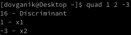
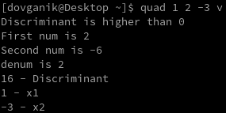

Quad
===

Syntax
---
`quad [a] [b] [c] [options]`

Options
---
	v - verbose(only for developers)

Installation
---
On any linux distribution

    git clone https://github.com/DovgaNik/Quad.git
    cd Quad
    sudo make install

Uninstallation
---
    git clone https://github.com/DovgaNik/Quad.git
    cd Quad
    sudo make uninstall
Or you can type

    sudo rm /bin/quad

Soon
---
  * I will add version for Windows(not soon)
